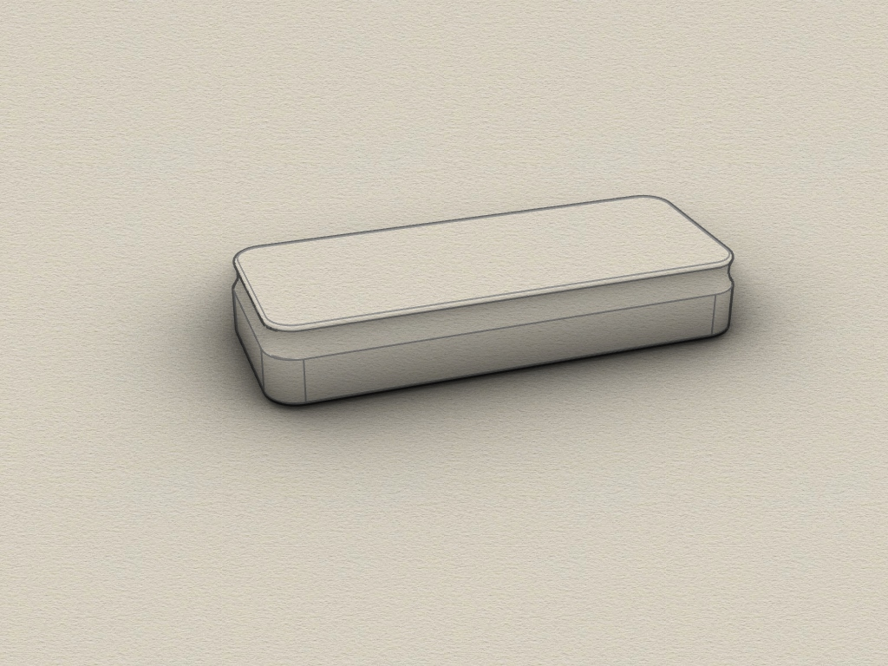
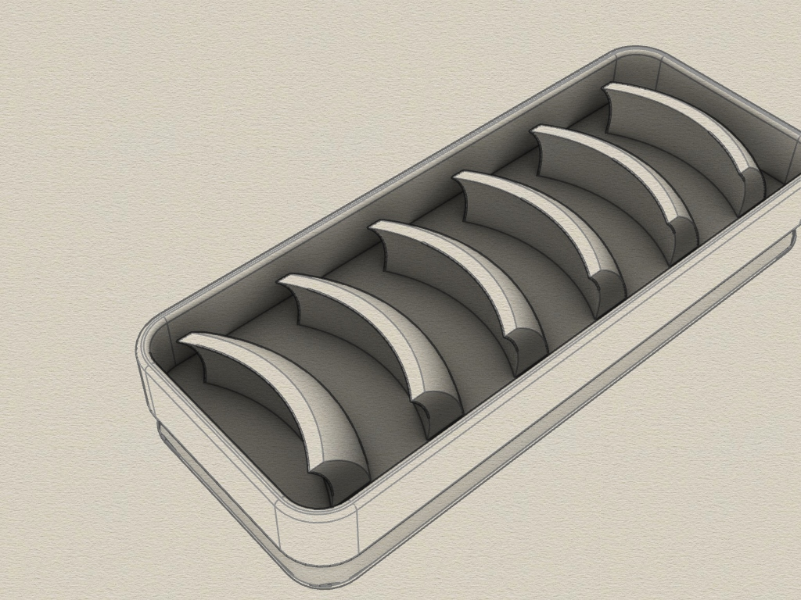

# Fish Scaly remover
3D printable tool for removing scaly from fish. Created with Rhino 6.
3D druckfähiges Tool zum entschuppen von Fischen.

## Tool

Requirements:
* 3D printer 
* Filament of your choice

## View
 
 
 

